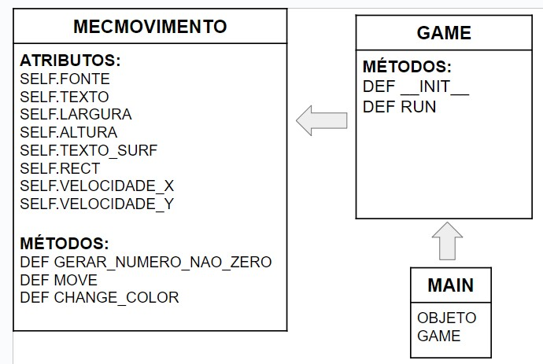

Projeto baseado no display do DVD

Projeto foi divido em três etapas: Mecânica de Movimento, Main e Game. Cada parte possui seus respectivos "Atributos" e "Métodos"

========================================
<h1>Tabela de Movimentos<h1>

========================================

